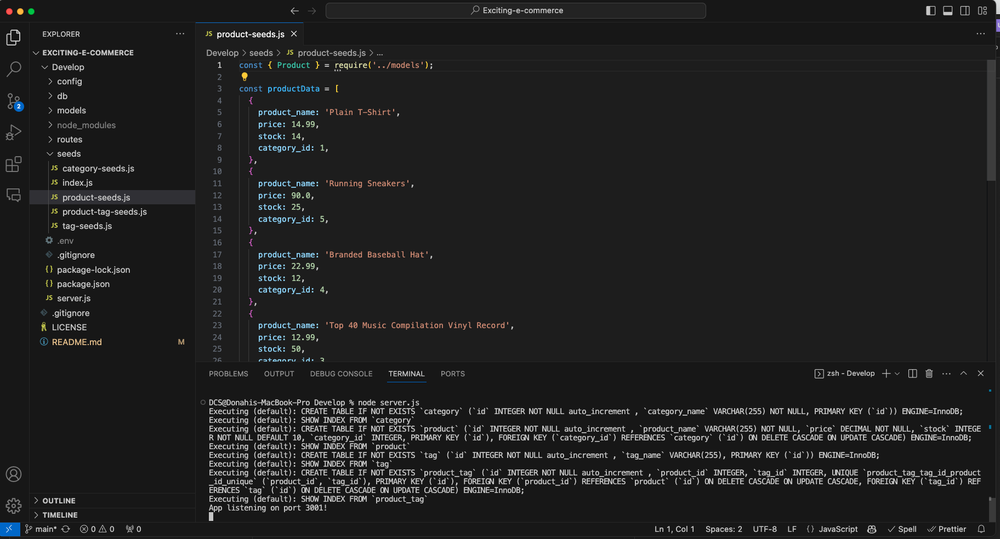
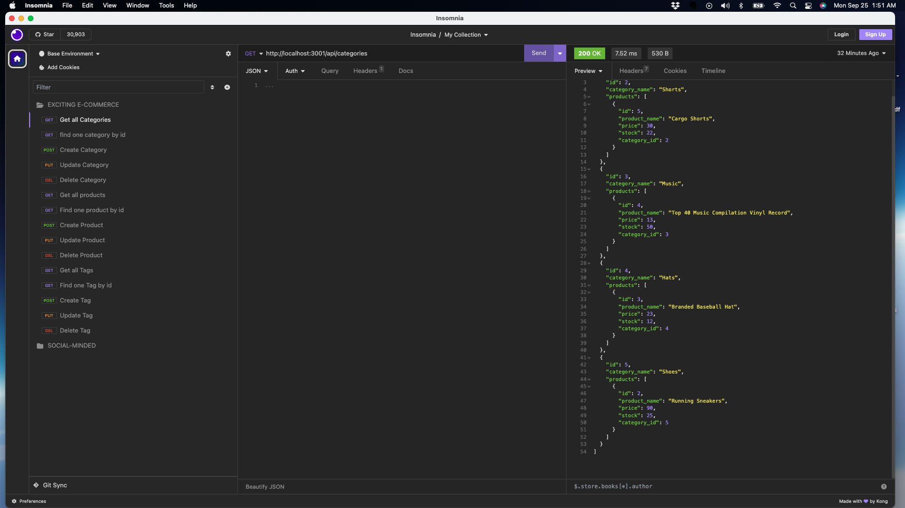

# EXCITING E-COMMERCE

### Table of Contents
1. [Description](#description)
2. [Installation](#installation)
3. [Technologies](#technologies) 
4. [Usage](#usage)
5. [Images](#images)
6. [Contributing](#contributing)
7. [Collaborators](#collaborators)
8. [Questions](#questions)
9. [License](#license)
10. [Video Walkthrough](#video-walkthrough)

### Description
This project is an e-commerce back end application that demonstrates the architecture of an e-commerce website database. The application uses Express.js API and Sequelize to interact with a MySQL database. The application allows users to view, add, update, and delete categories, products, and tags. The application also allows users to view products by category and tags. The application uses Insomnia Core to test the API routes.

### Technologies
This project utilizes the following technologies:
- Node.js
- Express
- MySQL2
- Sequelize

### Installation
To install this project, follow these steps:
1. Clone the repository: `git clone https://github.com/Augustus1110/Exciting-e-commerce.git`
2. Install the required dependencies: `npm install`
3. Source the schema.sql file in the db folder to create the database
4. Seed the database: `npm run seed`

### Usage
To use this project, follow these steps:

1. Start the development server: `node server.js`
2. Open Insomnia Core and test the API routes

### Images

### Contributing
Contributions to this project are currently not being accepted. If you would like to contribute, please contact me at the email listed below.

### Collaborators
This project was completed with guidance and assistance from EdX/UC Berkeley Extension tutor, Robby Kurle. 

### Questions
If you have any questions, please contact me:

- GitHub: [Augustus1110](https://github.com/Augustus1110)
- Email: donahi22@gmail.com

### License
This project is licensed under the [MIT License](https://opensource.org/licenses/MIT).

### Video Walkthrough
(https://drive.google.com/file/d/1zQnE5s8MSJECHC1VIo2oMo1rZvnmGDeF/view)